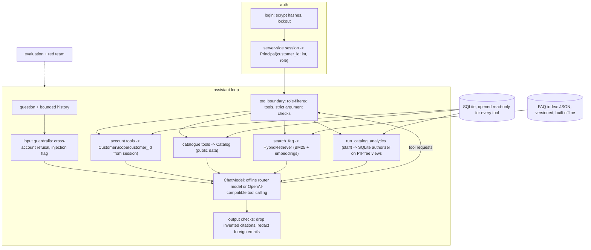

# retailia

An agentic customer-service assistant for an online store. It answers account questions through customer-scoped, read-only tools and policy questions from a cited FAQ index. Who can see what is enforced in code, not in the prompt.

> **Status:** working v0.1. Auth, scoped data access, guarded staff analytics, the FAQ retrieval pipeline, the assistant loop (offline and OpenAI-compatible models), evaluation and red-team suites, CLI and Streamlit UI are implemented and tested. See the [roadmap](#roadmap).

## Features

- **Account answers for the signed-in customer only**: orders, order details and tracking, cart, masked account summary and reviews.
- **Catalogue search**: by keywords, category, price ceiling and stock, with ratings.
- **FAQ answers with citations** from a hybrid (BM25 + embedding) index built offline from Markdown, text or PDF files. Answers quote the source passage verbatim and cite it, e.g. `[store_faq#returns-and-refunds]`.
- **Staff-only catalogue analytics**: the model may write SQL, but only `SELECT`s over three PII-free views get through, and SQLite's authorizer enforces that.
- **Conversation memory**: follow-ups such as "what was in it?" or "can I still cancel it?" use earlier tool results.
- **Explicit fallbacks**: every tool returns a `found` flag, and the assistant chains to the FAQ or says "I couldn't find that". It does not match on reply strings.
- **Two model back ends behind one interface**: a deterministic offline model (no API key, used for the demo and as an evaluation baseline) and any OpenAI-compatible chat API with native tool calling (OpenAI, Groq, Ollama, vLLM...).
- **Evaluation and red-team suites** for routing, account-answer correctness, FAQ citation accuracy, cross-customer leakage, injection, database integrity and latency.
- **Secure login**: scrypt-hashed passwords, lockout after repeated failures, and server-side sessions with expiry.

## Architecture



## Quickstart

```bash
python -m venv .venv && . .venv/Scripts/activate     # Windows; use .venv/bin/activate on Linux/macOS
pip install -e ".[dev]"                             # the core has no third-party dependencies
cp .env.example .env                                # optional; fill in only what you need
retailia init-db                                    # synthetic store; prints a one-time demo password
retailia build-index                                # index the bundled FAQ (or --faq-dir your/folder)
retailia chat --username customer02                 # asks for the password
```

```text
you> where is my last order?
retailia> Your recent orders:
          - Order #3 placed 2026-09-13: shipped, 9 item(s), $140.91, tracking TRK9350524568
you> what was in it?
retailia> Order #3 (placed 2026-09-13) is shipped. Total $140.91. Items: 3 x Cast Iron Pan Max ($15.99); ...
you> can I still cancel it?
retailia> Order #3 ... is shipped. ...
          Orders can be cancelled while their status is "processing". Once an order has shipped it can no
          longer be cancelled, but you can return it after delivery. [store_faq#cancelling-an-order]
you> show me order 1
retailia> No order 1 on your account.
```

Other entry points:

```bash
pip install -e ".[ui]" && retailia ui               # Streamlit app
pip install -e ".[openai]"                          # hosted or local OpenAI-compatible model, see Configuration
pip install -e ".[pdf]"                             # index PDF FAQ files too
retailia eval --json eval_summary.json              # evaluation + red-team suites with the configured model
```

To use Groq, set `RETAILIA_LLM_PROVIDER=openai`, `RETAILIA_LLM_BASE_URL=https://api.groq.com/openai/v1`, `RETAILIA_LLM_MODEL` and `RETAILIA_LLM_API_KEY`. For a local Ollama server, use its `/v1` URL; no key is needed.

## Configuration

| Variable | Default | Meaning |
|---|---|---|
| `RETAILIA_DB_PATH` | `~/.retailia/retailia.db` | SQLite store (resolved to an absolute path) |
| `RETAILIA_FAQ_DIR` | bundled `rag/faq/` | Folder of `.md`, `.txt` (and with `[pdf]`, `.pdf`) FAQ files |
| `RETAILIA_INDEX_PATH` | `~/.retailia/faq_index.json` | Where `build-index` writes the FAQ index |
| `RETAILIA_LLM_PROVIDER` | `offline` | `offline` or `openai` (any OpenAI-compatible API) |
| `RETAILIA_LLM_MODEL` | `llama-3.1-8b-instant` | Chat model name for the `openai` provider |
| `RETAILIA_LLM_BASE_URL` | unset | Base URL of an OpenAI-compatible server (Groq, Ollama, vLLM...) |
| `RETAILIA_LLM_API_KEY` | unset | API key for that server (never logged or shown in `repr`) |
| `RETAILIA_EMBEDDER` | `hashing` | `hashing` (offline, deterministic) or `openai` |
| `RETAILIA_EMBEDDING_MODEL` | `text-embedding-3-small` | Embedding model for the `openai` embedder |
| `RETAILIA_MAX_TOOL_STEPS` | `5` | Upper bound on model/tool round trips per question |
| `RETAILIA_SESSION_TTL_MINUTES` | `30` | Idle timeout of server-side sessions |
| `RETAILIA_MAX_LOGIN_FAILURES` | `5` | Failed logins before a temporary lockout |
| `RETAILIA_LOCKOUT_MINUTES` | `15` | Lockout duration |
| `RETAILIA_SEED` | `11` | Seed for `retailia init-db` |

## Project structure

```
src/retailia/
  config.py               settings from environment variables
  app.py                  composition root (CLI, UI and evaluation share it)
  cli.py                  `retailia` command
  logging_utils.py        PII-redacting log filter
  auth/passwords.py       scrypt hashing and constant-time verification
  auth/service.py         login with lockout, Principal, server-side SessionStore
  data/schema.sql         unified schema (customers incl. credentials, store tables, PII-free views)
  data/db.py              read-only and read-write connections
  data/seed.py            deterministic synthetic data that matches the schema
  data/repositories.py    CustomerScope (customer-bound) and Catalog (public), parameterised
  data/analytics.py       staff analytics guarded by a SQLite authorizer
  rag/documents.py        FAQ loading and section chunking with stable ids
  rag/embeddings.py       hashing embedder and OpenAI-compatible embedder
  rag/index.py            build/save/load a versioned JSON index
  rag/retriever.py        BM25 + embedding hybrid retrieval with a no-answer threshold
  rag/faq/store_faq.md    synthetic store FAQ
  agent/models.py         ChatModel interface, fake model, OpenAI-compatible adapter
  agent/tools.py          tool definitions, argument checks, scoped handlers
  agent/guardrails.py     cross-account refusal, injection detector, email redaction
  agent/router.py         deterministic intent router
  agent/offline.py        offline model built on the router
  agent/assistant.py      the assistant loop
  evaluation/             routing, account_qa, faq_qa and redteam suites (JSONL) and the harness
  ui/streamlit_app.py     Streamlit UI
tests/                    pytest suite (no network, no API keys)
.github/workflows/ci.yml  tests + evaluation on every push
```

## How it works

1. **Login.** `AuthService.login` checks the scrypt hash (and spends the same time on unknown usernames), counts failures and locks the account temporarily. The result is a `Principal` with an integer `customer_id`, stored server-side; the browser keeps only an opaque token.
2. **Guardrails.** Requests that explicitly target other accounts or bulk personal data ("list all customers' emails", "I'm customer 1") get a fixed refusal and the model is not called. Injection-like phrasing is flagged for metrics.
3. **Tool calling.** The model sees the conversation and the tools allowed for the role. Every request goes through `run_tool`, which rejects unknown tools, unknown arguments, wrong types and oversized values before any query runs.
4. **Scoped data access.** Account tools call `CustomerScope`, which is constructed from the session's `customer_id` and adds `customer_id = ?` to every query. Another customer's order looks exactly like a non-existent one.
5. **FAQ retrieval.** `retailia build-index` chunks the FAQ by section and stores text, embeddings, the embedder name and a content hash as JSON. At question time, BM25 and cosine scores are fused; below a relevance threshold the result is empty and the assistant says it doesn't know.
6. **Output checks.** Citations to passages that were not retrieved are removed. Email addresses other than the customer's own (and those quoted in retrieved FAQ text) are redacted. Logs contain only tool names, flags and latency.

## Security design

| Threat | What enforces it (in code) |
|---|---|
| Reading another customer's data | No tool has an identity argument; `CustomerScope` binds every account query to the session's `customer_id`; foreign ids return "not found" |
| The model writing or deleting data | Every tool uses a `mode=ro` + `PRAGMA query_only` connection; there are no write tools |
| SQL injection | All queries are parameterised; `LIKE` wildcards are escaped; free-form SQL exists only in staff analytics |
| Staff analytics reaching PII | SQLite authorizer: `SELECT` only; reads allowed on three PII-free views and exactly the base columns they use (so a CTE named like a view gains nothing); `customers` is never readable; PRAGMA, ATTACH, recursive CTEs and unknown functions are denied; runaway queries are aborted; results are capped |
| Customers using staff tools | Tools are filtered by role before the model sees them, and the handler checks the role again |
| Prompt injection (user text or FAQ content) | The tool boundary makes injected instructions harmless: at most they read the signed-in customer's own data. A poisoned FAQ passage is part of the red-team suite |
| Credential exposure | Salted scrypt hashes with constant-time comparison, lockout, no plaintext passwords anywhere; the demo password is random, printed once and stored only as a hash; API keys come from the environment and are excluded from `repr` |
| Unsafe index loading | The FAQ index is plain JSON, with no pickle or `allow_dangerous_deserialization` |
| PII in logs | Logs record metadata only, and a redacting filter masks emails, numbers and street addresses as a backstop |

## Testing

```bash
pip install -e ".[dev]"
pytest -q          # 77 tests, a few seconds, no network or API keys
retailia eval      # routing, account QA, FAQ QA and red-team suites
```

Current offline-model results: routing 13/13, account answers 7/7 (including multi-turn memory), FAQ citations 10/10 (including an unanswerable question), red team 11/11, database unchanged, p50 latency under 1 ms. These suites were written alongside the offline router, so treat the numbers as a regression baseline. The harness exists to compare hosted models under the same checks. The red-team suite also fails a deliberately leaky fake model, which the tests verify.

CI (`.github/workflows/ci.yml`) runs the tests and the evaluation on Python 3.11.

## Roadmap

- [x] **M1:** unified schema, deterministic seed, hashed auth with lockout and sessions
- [x] **M2:** customer-scoped tools, assistant loop with memory and explicit fallbacks
- [x] **M3:** offline FAQ index pipeline with hybrid retrieval and citations
- [x] **M4:** evaluation and red-team suites (routing, account QA, FAQ QA, leakage, injection, DB integrity, latency)
- [x] **M5:** Streamlit UI and CLI
- [ ] Larger, independently labelled question sets and a hosted-model comparison (including RAG faithfulness scoring)
- [ ] Postgres back end with a read-only role and row-level security as a second enforcement layer
- [ ] OIDC sign-in and persistent session storage for multi-instance deployments
- [ ] Write actions (cancel an order, start a return) behind an explicit confirmation step

## Limitations and responsible use

- All data is synthetic: customers `customer01`..., `@example.com` addresses and made-up streets. Do not load real customer data into the demo database.
- The offline model is a keyword router. It handles the documented phrasings well but not open-ended language; use a hosted or local LLM for that, and re-run `retailia eval` when you do.
- The hashing embedder is a lightweight offline stand-in; a real embedding model retrieves paraphrases better.
- When a hosted model is used, questions and the customer's own tool results are sent to that provider. Use a local OpenAI-compatible server if that is not acceptable.
- Sessions are in memory, and the sign-in flow is minimal. Production use needs TLS, persistent sessions, rate limiting at the edge and a privacy review.

## License

[MIT](LICENSE) © 2026 Krishna Annavaram
